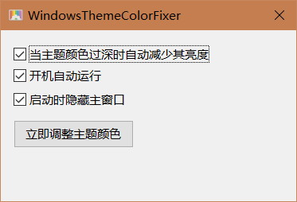
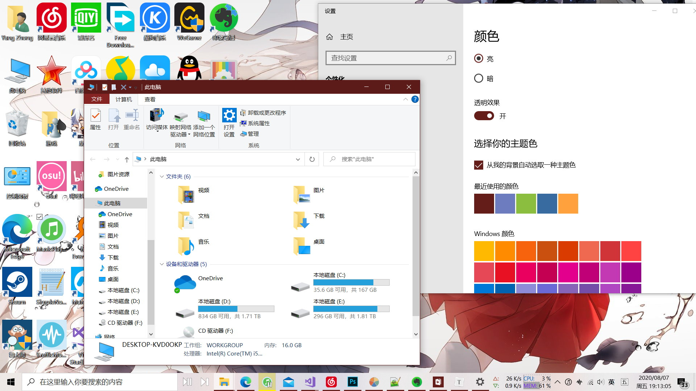
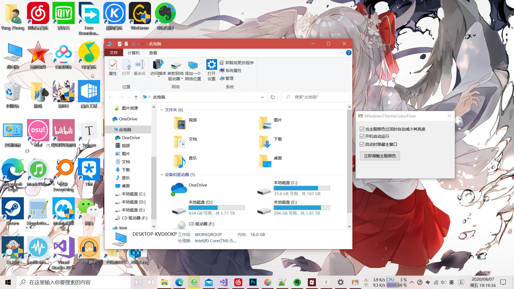
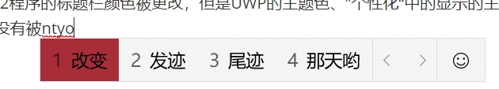

# WindowsThemeColorFixer
## 截图

## 简介

在 Windows10 1809 及后面的版本中，如果你在”个性化“>”颜色“中设置了”从我的背景中自动选取一种主题颜色“的话，那么自动获取的颜色全部都是非常深的颜色，这在浅色主题中显得尤其违和。

如下图所示：

这个问题是从Windows10 1809版本开始的，这似乎是微软有意这么做的，但是我完全无法理解微软这么做的意义是什么。

为了解决这个问题，我开发了这个小工具，它可以在系统主题色改变时获取主题颜色，并增加其亮度，再修改系统的主题色为增加亮度后的颜色。

如图所示：

从上图可以看到，窗口标题栏的颜色已经被调整到正常颜色了。

## 已知问题

1. 目前，使用此工具后，只有Win32程序的标题栏颜色被更改，但是UWP的主题色、”个性化“中的显示的主题色、任务栏图标最下面矩形的颜色，以及自带输入法的颜色都没有被改变，颜色仍然较深导致文字不明显，如图所示：

目前暂时不清楚如果通过代码修改这部分的颜色，如果有知道的大神还望告知。

目前发现一款叫”Wallpaper Engine“的软件能够实现修改系统主题色的功能，而且它也能够修改UWP的主题色，说明这个还是有办法实现的。

2. 主窗口中的一个选项描述有误，“当主题颜色过深时自动减少其亮度”应当纠正为“当主题颜色过深时自动增加其亮度”。
